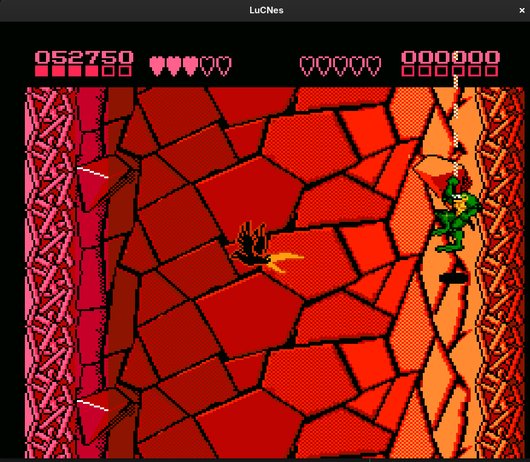
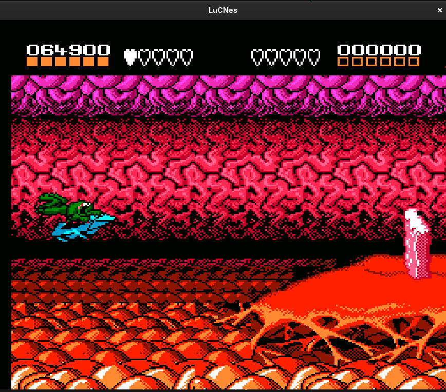
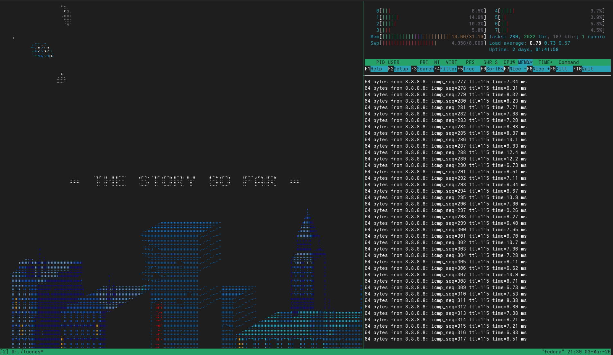
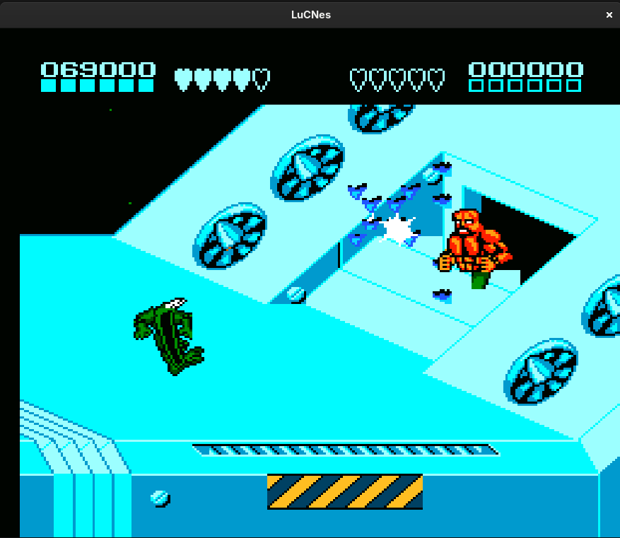
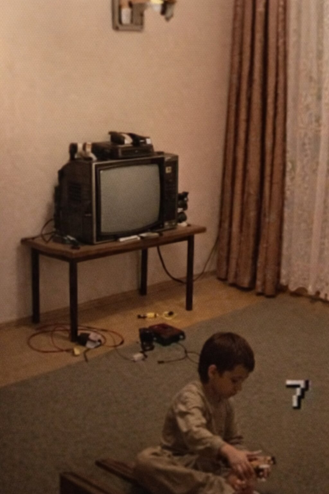

# LuCNes

A lightweight NES emulator written in pure C. Crafted for fun, with minimal dependencies and clean architecture. It doesn't aim for high accuracy of the original hardware and instead tries to balance performance with clean and readable solutions. The emulator uses a hybrid I/O triggered cycle stepping synchronization model. if an instrution reads or writes I/O register, synchronization happens right before actual I/O access. This introduces about 1/3 cpu cycle (1 ppu cycles) timing inaccuracy, which is still good enough for almost all games. At the same time, some game sensative flags and registers are emulated more precisely. For example, write to ppu mask register updates the rendering enable/disable flag with 3-4 ppu cycles delay (based on real hardware tests), and this behaviour is emulated accordingly.



The main goal, though, was to have a lightweight, simple emulator for personal use: portable across different architectures, devices, and OS, easy to extend with any ideas, and fun for playing retro games on an emulator implemented from scratch.



## Terminal video backend (Braille)
Build with:
```sh
VIDEO_BACKEND=vt AUDIO_BACKEND=pipe make
```
This emulator can render NES video output directly in a terminal emulator. It uses unicode braille characters to pack multiple pixels into one cell. It can also be used over ssh or on linux VT, but output quality depends on unicode rendering and braille characters support.

Limitations:
 - A Braille cell is 2x4 dots, but it effectively supports only one foreground color and one background color per cell. The backend picks the dominant color per cell, so areas with more than two colors in the same cell may show visible artifacts.
 - Only the foreground color is set. The background stays at the terminal default. Switching the background color can help when the game background is not dark, but using multiple background colors within one frame often distorts the image even more.
 - Output resolution is limited by the terminal window size, which may not fit standard NTSC/PAL frame sizes.



## The Story Before Time

This emulator is a small passion project inspired by my love for programming and retro consoles. :blue_heart:

I started writing it back in 2015, shortly after joining a company working on virtualization software. I wanted to understand how old hardware emulation works, so I chose what seemed like the simplest target at the time: an NES emulator. As I dug into timing and CPU/PPU synchronization (they run at different frequencies, and their data exchange has non-obvious, poorly documented delays), it became clear it wasn't as simple as it looked. I've been coming back to the project whenever I feel like it and have time.

Although COVID brought many challenges, it also gave me some free time to implement PPU emulation. The emulator became playable, but without sound it remained unfinished for a few more years. The final trigger to finish it was my kids. They're three years old. They love watching me play video games and sometimes try to join in, but controlling 3D games is still difficult for them. I thought they might enjoy 2D games more, and that's when I remembered this project.
Sure, we could have used another emulator. But finishing this one felt more meaningful to me. After all, only the APU was left, and it felt right to finally complete it.
And now we play together, just like I did when I was a kid. My son just bursts into laughter when we play BTDD.



I first met this console when I was five. My mom gave it to me. It was a pirated Famicom clone. Back then, in the former USSR, pirated clones were basically the only option. Anyone who had one at that age will understand: it was my first unforgettable video game experience.



My mom is gone now. This little fan project, made with love, is dedicated to her. Thank you for a happy childhood. :sparkles:
